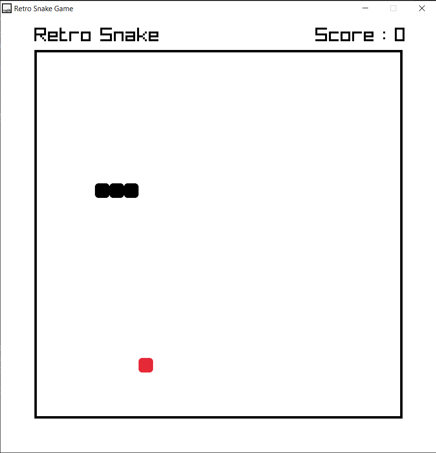
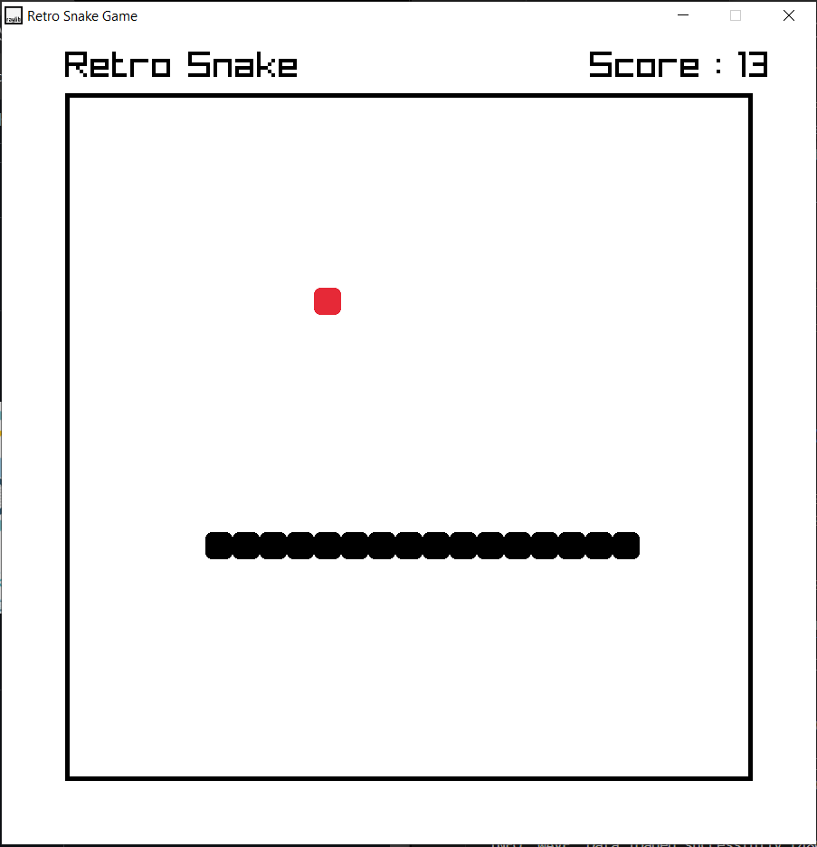

# Retro Snake Game

The OG Snake game with color combition as seen in Nothing OS

you can checkout/play the game live here : [play](https://sumeetgedam.github.io/snake_game_using_raylib_CPP/snake.html)

Thanks to [@educ8s](https://github.com/educ8s) for the template and tutorial to get started with rayLib which made the development easier

Full screen issue on web was fixed with the points 5 and 6 mentioned here : https://github.com/raysan5/raylib/issues/3231#issuecomment-1705684669